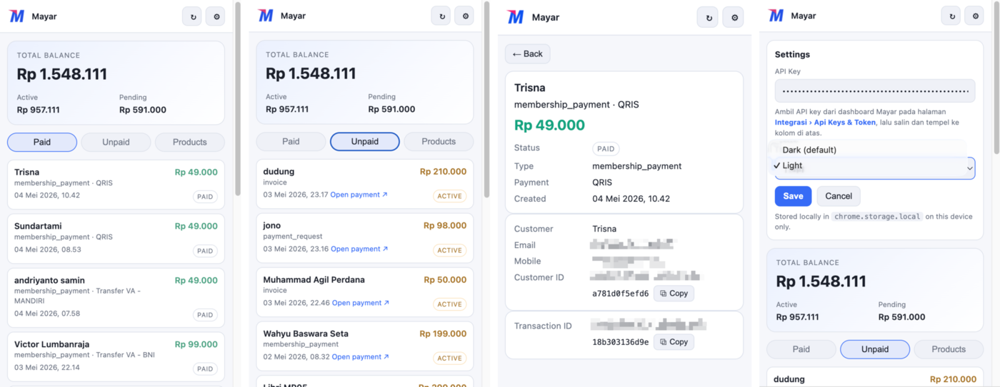

# Mayar Balance & Transactions

A Chrome extension that puts your [Mayar](https://mayar.id) account one click away in the toolbar — check your balance, browse paid and unpaid transactions, view transaction details, and copy product / checkout links without opening the dashboard.



## Install

### From the Chrome Web Store (recommended)

[**Add to Chrome →**](https://chromewebstore.google.com/detail/mayar-balance-transaction/maodipinhjgkmklcahljendkhepmpfah)

### Manual install (development)

1. Clone or download this repo.
2. Open `chrome://extensions` and toggle **Developer mode** on.
3. Click **Load unpacked** and select the project folder.
4. Pin the extension to the toolbar.

## Setup

1. Click the extension icon and open **⚙ Settings**.
2. Paste your Mayar API key. You can get one from the Mayar dashboard at **Integrasi › Api Keys & Token** ([web.mayar.id/integration/apikey](https://web.mayar.id/integration/apikey)).
3. (Optional) Pick **Light** or **Dark** theme. Dark is the default.
4. Click **Save**.

The API key is stored locally in `chrome.storage.local` on your device and never leaves your browser except in the `Authorization` header sent to `api.mayar.id`.

## Features

- **Balance card** — total, active (withdrawable), and pending amounts in IDR.
- **Paid transactions** — paginated list with customer, amount, type · payment method, and status.
- **Unpaid transactions** — paginated list with payment URL shortcut.
- **Transaction detail** — tap any transaction to see customer info (name / email / mobile / customer ID), payment URL with copy + open buttons, and a copyable transaction ID.
- **Products** — list your Mayar products with one-click **Copy link** (public product page) and **Copy checkout** (payment URL) buttons. Membership products are labelled **Various** instead of `Rp 0` since their amount is variable.
- **Search** — filter products by name, debounced.
- **Light / Dark theme** with persistent preference.

## Permissions

| Permission | Why |
|---|---|
| `storage` | Persist the API key and theme preference locally. |
| `https://*.mayar.id/*` | Call the Mayar HTTP API (`api.mayar.id`). |

## API endpoints used

All endpoints are documented at [docs.mayar.id](https://docs.mayar.id).

- `GET /hl/v1/balance`
- `GET /hl/v1/transactions?page=&pageSize=`
- `GET /hl/v1/transactions/unpaid?page=&pageSize=`
- `GET /hl/v1/product?page=&pageSize=&search=`

## Project layout

```
manifest.json        # MV3 manifest
popup.html           # Popup markup
popup.css            # Popup styles (light + dark themes)
popup.js             # Popup logic (state, fetching, rendering)
icons/               # Toolbar / store icons
docs/                # README assets
```

## Contributing

Pull requests are welcome. To work locally, follow the manual install steps above; reload the extension from `chrome://extensions` after edits.
